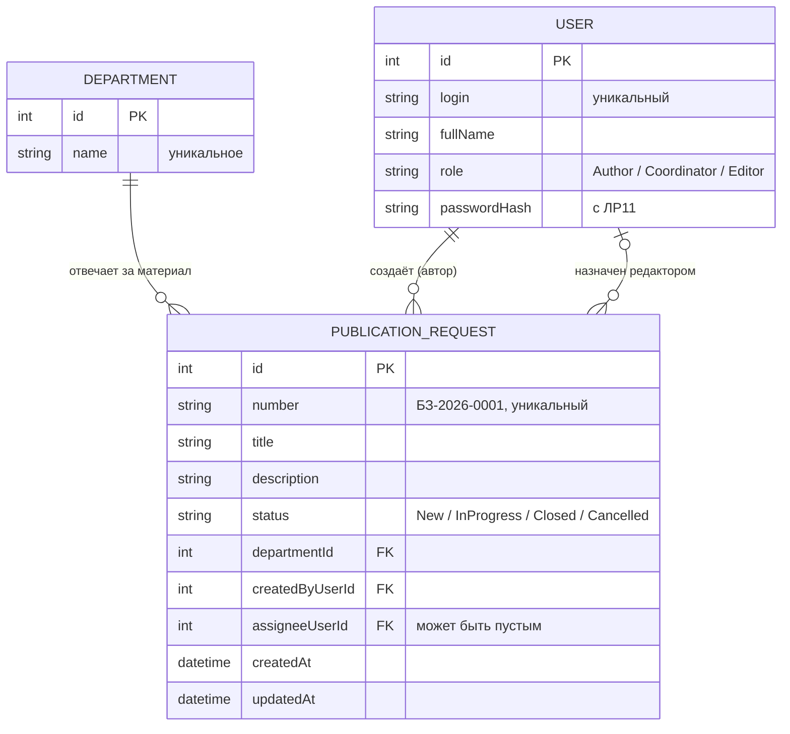

# Модель данных

Курс: Б1.В.ДЭ.01.02.02 · КГЭУ · семестр 1 · 2026/2027  
Студент: Чам Кебба · Группа: ТРИС-2-23 · ЛР2 · Дата: 21.09.2026

Связано: [требования ЛР1](lab-01-requirements.md) · [API](api-contract.md) · [матрица требований](requirements-matrix.md)

---

## Словарь проекта

| Термин курса | Термин моей темы | Имя в коде и БД |
|--------------|------------------|-----------------|
| Ticket | заявка на публикацию материала | `PublicationRequest`, путь `/api/publication-requests`, таблица `publication_requests` |
| Site | подразделение | `Department`, поле `departmentId`, таблица `departments` |
| User | пользователь: автор / координатор / редактор | `User`, поле `role` = `Author` / `Coordinator` / `Editor`, таблица `users` |

Правило имён: в JSON, Python и Vue — `camelCase` (`departmentId`), в PostgreSQL — `snake_case` (`department_id`). Перевод между ними делает ORM, слова одни и те же на весь семестр.

## ER-диаграмма

### Связи словами

- **Одно подразделение — много заявок** (1:N). У каждой заявки ровно одно подразделение.
- **Один пользователь-автор создаёт много заявок** (1:N). У каждой заявки ровно один автор (`createdByUserId`).
- **Один пользователь-редактор может быть назначен на много заявок** (1:N, необязательная). **У новой заявки редактора нет**: `assigneeUserId` = `NULL`, пока координатор его не назначит.

## Сущности и поля

### PublicationRequest — заявка на публикацию (главный объект)

| Поле (JSON) | Столбец в БД | Тип PostgreSQL | Ключ / ограничение | Смысл |
|-------------|--------------|----------------|--------------------|-------|
| `id` | `id` | `integer`, identity | **PK** | машинный ключ, задаёт сервер |
| `number` | `number` | `varchar(20)` | `UNIQUE`, `NOT NULL` | человеческий номер `БЗ-2026-0001`, задаёт сервер |
| `title` | `title` | `varchar(80)` | `NOT NULL`, 5–80 символов | название материала |
| `description` | `description` | `varchar(500)` | `NOT NULL`, 10–500 символов | что опубликовать или изменить и на каком основании |
| `status` | `status` | `varchar(20)` | `NOT NULL`, `CHECK (status IN ('New','InProgress','Closed','Cancelled'))`, по умолчанию `New` | этап процесса |
| `departmentId` | `department_id` | `integer` | **FK** → `departments.id`, `NOT NULL` | подразделение, которое отвечает за материал |
| `createdByUserId` | `created_by_user_id` | `integer` | **FK** → `users.id`, `NOT NULL` | автор заявки |
| `assigneeUserId` | `assignee_user_id` | `integer` | **FK** → `users.id`, **может быть `NULL`** | назначенный редактор |
| `createdAt` | `created_at` | `timestamptz` | `NOT NULL` | когда создана |
| `updatedAt` | `updated_at` | `timestamptz` | `NOT NULL` | когда последний раз менялась |

`id` и `number` — **разные поля**: `id` нужен базе и API для ссылок, `number` — людям («заявка БЗ-2026-0007»). Номер не используется как ключ.

### Department — подразделение (справочник)

| Поле (JSON) | Столбец в БД | Тип PostgreSQL | Ключ / ограничение | Смысл |
|-------------|--------------|----------------|--------------------|-------|
| `id` | `id` | `integer`, identity | **PK** | машинный ключ |
| `name` | `name` | `varchar(150)` | `UNIQUE`, `NOT NULL` | название подразделения |

Примеры строк: 1 — Учебный отдел · 2 — Деканат · 3 — Студенческий городок · 4 — ИТ-служба · 5 — Международный отдел · 6 — Библиотека.

### User — пользователь

| Поле (JSON) | Столбец в БД | Тип PostgreSQL | Ключ / ограничение | Смысл |
|-------------|--------------|----------------|--------------------|-------|
| `id` | `id` | `integer`, identity | **PK** | машинный ключ (не фамилия) |
| `login` | `login` | `varchar(50)` | `UNIQUE`, `NOT NULL` | логин для входа |
| `fullName` | `full_name` | `varchar(150)` | `NOT NULL` | ФИО, показывается в списке |
| `role` | `role` | `varchar(20)` | `NOT NULL`, `CHECK (role IN ('Author','Coordinator','Editor'))` | роль: автор / координатор / редактор |
| — | `password_hash` | `varchar(255)` | `NOT NULL` (с ЛР11) | только хэш пароля; в API не отдаётся |

Роль — поле, а не отдельная таблица: ролей три и они фиксированы, `CHECK` не даёт записать лишнее. Если в ВКР добавятся роли «студент» и «преподаватель», роль вынесется в отдельный справочник.

## Проверка 3НФ

**1НФ.** Все поля атомарные: одно значение в ячейке, нет списков через запятую.

**2НФ.** Ключ каждой таблицы простой (`id`), поэтому все поля зависят от ключа целиком.

**3НФ.** Название подразделения хранится в сущности `Department` один раз. `PublicationRequest` содержит только внешний ключ `departmentId`. При переименовании подразделения меняется одна строка, поэтому текст названия не дублируется в заявках. Так же ФИО автора и редактора хранится только в `User`, а в заявке — `createdByUserId` и `assigneeUserId`. Транзитивных зависимостей (поле зависит от другого неключевого поля) нет.

Как это выглядит в данных:

| id | number | title | departmentId | status | assigneeUserId |
|----|--------|-------|--------------|--------|----------------|
| 1 | БЗ-2026-0001 | Порядок оформления академического отпуска | 1 | New | NULL |
| 2 | БЗ-2026-0002 | Как получить доступ к ЭИОС | 4 | InProgress | 3 |

В заявке — число `1`, а слова «Учебный отдел» лежат только в `departments`.
